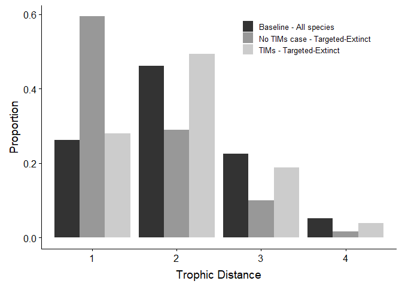
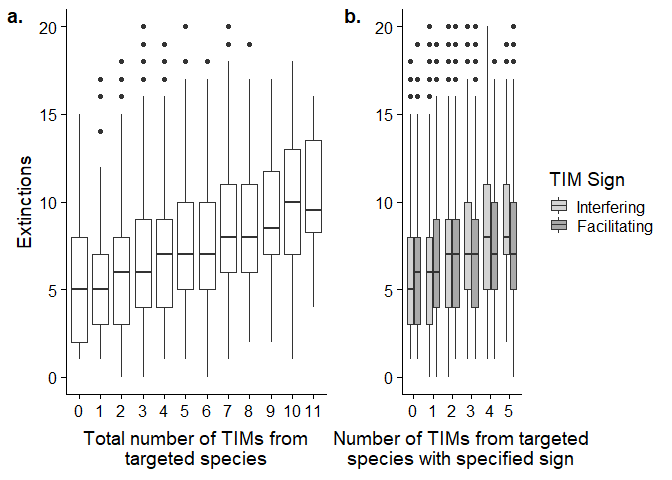

Code
================
Chris Terry
02 April, 2019

## Introduction

This is a tidied version of the code used to generate the results in
Terry et al (2019) *Interaction modifications lead to greater robustness
than pairwise non-trophic effects in food webs*

Be warned some analyses take a significant time to run\! The simulation
outputs are pre-generated.

``` r
library(deSolve)
library(igraph)
library(numDeriv)
library(rootSolve)
library(NetIndices)
library(pbapply)
library(knitr)
library(cowplot)
library(mvbutils)
library(Rcpp)
library(pracma)
library(parallel)
library(tidyverse)

NUM_CORES <- 3 # Number of cores to use for parallel
```

``` r
try(sapply(paste0('Scripts/',list.files('Scripts')), source)->tmp)

ParallelRun <- function(DATA,FUNC,Name, ...){
  c1<- makeCluster(NUM_CORES)
  clusterEvalQ(c1,
               {require(dplyr);require(rootSolve);
                 require(deSolve);require(igraph);require(purrr)})->tmp
  clusterExport(c1,as.list(find.funs()[find.funs()!='LV']))
  pblapply(X =DATA, cl = c1,FUN = FUNC,...)-> tmp
  assign(value = tmp,Name)
  save(list=Name,file=paste0('Output from Simulations/',Name))
  stopCluster(c1) 
}

Unpacker <- function(SafeObject){
  SafeObject  %>%transpose %>% `[[`('result') %>% compact() -> x
  return(x)
}

ErrorFinder<- function(SafeObject){
  SafeObject  %>%transpose %>% `[[`('error') -> errormessages
  errormessages %>% map_lgl(is.null) %>% `!` %>% which %>% print
  errormessages %>% compact() %>% print()
}
```

# Methods

## Generating Baseline Communities

``` r
ParallelRun(1:500, CreateModel, 'BaseCommunities',S=35,C=0.14,smallestsize=18)

load('Output from Simulations/BaseCommunities')
BaseCommunities%>% map_lgl('Success') -> Successes
mean(Successes)
BaseCommunities_Success<-BaseCommunities[Successes]

save(BaseCommunities_Success,file='Output from Simulations/BaseCommunities_Success')
```

## Extinctions Without Any TIMs

``` r
load('Output from Simulations/BaseCommunities_Success')
```

### Build Models

``` r
dir.create('No_TIM')
ParallelRun(BaseCommunities_Success,
            AddTIMsMort, 'NoTIM_Models',
            TIM_Density = 0, 
            TIM_Inflexion = 1, TIM_Range = 2, ## Arbitary values, as unused! 
            TIM_Slopes = 1, 
            LimitTIMsPerInteraction =FALSE ,
            FolderName = 'No_TIM')
```

### Run Models

``` r
load('Output from Simulations/NoTIM_Models')
ParallelRun(NoTIM_Models[1:200],
            safely(RunMortality),
            'No_TIM_Extinctions',
            AddedMortality = 1)
```

## Test 1 - Comparison of TIM vs Pairwise

### Make the models:

``` r
dir.create('TIMmods')
ParallelRun(BaseCommunities_Success,
            AddTIMsMort,
            'TIMModels',
            TIM_Density = 0.05,
            TIM_Inflexion = 1, 
            TIM_Range = 4,
            TIM_Slopes = 4,
            LimitTIMsPerInteraction = TRUE, 
            FolderName = 'TIMmods')

dir.create('NTEmods')
ParallelRun(BaseCommunities_Success, 
            AddNTEsMort,
            'NTEModels',
            TIM_Density = 0.05,
            TIM_Inflexion = 1, 
            TIM_Range = 4,
            TIM_Slopes = 4)
```

### Run the models:

``` r
load('Output from Simulations/TIMModels')
ParallelRun(TIMModelsInflex,
            safely(EffectofMortality),
            'ExtinctionTIM' , 
            AddedMortality = 1)
```

## Test 2 - Relationship Between TIMs and Extinctions

Here just detailing one set of parameters. Orevious ran with other TIM
densities, slopes and ranges.

### Build Models

``` r
dir.create('LS_TIM')
ParallelRun(BaseCommunities_Success[1:200],
            AddTIMsMort, 
            'TIM_Models_Lots_Strong',
            TIM_Density = 0.08, 
            TIM_Inflexion = 1, TIM_Range = 3, TIM_Slopes = 3,
            LimitTIMsPerInteraction =FALSE, 
            FolderName = 'LS_TIM'  )
```

### Run Models

``` r
load('Output from Simulations/TIM_Models_Lots_Strong')
ParallelRun(TIM_Models_Lots_Strong,
            safely(RunMortality),
            'LS_TIM_Extinctions' , 
            AddedMortality = 1)
```

# Results

## Number of Extinctions TIMs vs Pairwise

``` r
load('Output from Simulations/No_TIM_Extinctions')
load('Output from Simulations/ExtinctionTIM')
load('Output from Simulations/ExtinctionNTE')

ExtinctionTIM %>%
  Unpacker  %>%
  bind_rows()  %>%
  mutate(Type = 'TIMs')%>%
  filter(ModelID <467)-> TIMs

ExtinctionNTE %>% 
  Unpacker%>%
  bind_rows()  %>%
  mutate(Type = 'NTEs')%>%
  filter(ModelID <467) -> NTEs

No_TIM_Extinctions %>%
  Unpacker%>%
  map_df(NumExtinctCalc)  %>%
  mutate(Type = 'NoTIMs') -> NoTIMs

TIM_NTE_comp<-bind_rows(NoTIMs, TIMs, NTEs)

## Success rates
BaseCommunities_Success[1:200] %>%
  map_dbl('StartingNum')%>%
  sum # 3983 starting
```

    ## [1] 3983

``` r
TIM_NTE_comp %>% 
  filter(Finished) %>%
  group_by(Type)%>% 
  count() %>%
  mutate(Percent = n / 39.83 )
```

    ## # A tibble: 3 x 3
    ## # Groups:   Type [3]
    ##   Type       n Percent
    ##   <chr>  <int>   <dbl>
    ## 1 NoTIMs  3975    99.8
    ## 2 NTEs    3897    97.8
    ## 3 TIMs    3736    93.8

``` r
TIM_NTE_comp %>%
  ggplot(aes(y= Extinctions, x= Type))+
  geom_boxplot(outlier.alpha = 0.1)+
  scale_x_discrete(labels=c('No TIMs', 'Pairwise\nModel', 'Full TIM\nModel'))+
  labs(x='')
```

<!-- -->

``` r
ggsave('Figures/Figure4.png', width=5, height=5, dpi = 400)
ggsave('Figures/Figure4.pdf', width=5, height=5, dpi = 400)


TIM_NTE_comp %>%
  group_by(Type)%>%
  summarise(MeanExt=mean(Extinctions, na.rm=TRUE) ,
            MeanFuncExt=mean(NumFuncExtinction, na.rm=TRUE) ,
            MeanExp=mean(NumPopExplosion, na.rm=TRUE),
            SDExt=sd(Extinctions, na.rm=TRUE) ,
            SDFuncExt=sd(NumFuncExtinction, na.rm=TRUE) ,
            SDExp=sd(NumPopExplosion, na.rm=TRUE),
            TotExp=sum(NumPopExplosion, na.rm=TRUE)) %>%
  kable(digits = 3)
```

| Type   | MeanExt | MeanFuncExt | MeanExp | SDExt | SDFuncExt | SDExp | TotExp |
| :----- | ------: | ----------: | ------: | ----: | --------: | ----: | -----: |
| NoTIMs |   1.870 |       1.976 |   0.090 | 1.291 |     1.388 | 0.320 |    358 |
| NTEs   |  11.383 |      11.407 |   0.188 | 6.764 |     6.753 | 0.529 |    732 |
| TIMs   |   5.748 |       5.847 |   0.053 | 3.739 |     3.796 | 0.239 |    197 |

``` r
t.test(TIM_NTE_comp$Extinctions[TIM_NTE_comp$Type=='NTEs'],
       TIM_NTE_comp$Extinctions[TIM_NTE_comp$Type=='TIMs'], paired=TRUE)
```

    ## 
    ##  Paired t-test
    ## 
    ## data:  TIM_NTE_comp$Extinctions[TIM_NTE_comp$Type == "NTEs"] and TIM_NTE_comp$Extinctions[TIM_NTE_comp$Type == "TIMs"]
    ## t = 59.886, df = 3665, p-value < 2.2e-16
    ## alternative hypothesis: true difference in means is not equal to 0
    ## 95 percent confidence interval:
    ##  5.315977 5.675839
    ## sample estimates:
    ## mean of the differences 
    ##                5.495908

## Distribution of Extinctions

### Trophic Distances from targtted to extinct species

First get data into shape:

``` r
load('Output from Simulations/No_TIM_Extinctions')
load('Output from Simulations/LS_TIM_Extinctions')
```

``` r
TrophDistCalc<- function(Model){
  Model$web %>%
    graph_from_adjacency_matrix() %>%
    distances(mode = 'all') -> TrophicDistancesMatrix
  diag(TrophicDistancesMatrix)<-NA
  return(data.frame('TrophDistList'=as.vector(TrophicDistancesMatrix)))
}

BaseCommunities_Success %>%
  map(CutModelDown)%>%
  map_df(TrophDistCalc) %>%
  filter(!is.na(TrophDistList))%>%
  filter(TrophDistList <5)%>%
  mutate(TIMType = 'Baseline')-> AllTrophDist

LS_TIM_Extinctions  %>%
  Unpacker%>% 
  map_df(TrophDistTIMs) %>%
  mutate(TIMType='TIMs (LS) Extinctions') %>%
  filter(!is.na(TrophDistList))%>%
  filter(TrophDistList <5)-> LS_Results_TrophDist

No_TIM_Extinctions  %>%Unpacker%>% 
  map_df(TrophDistTIMs) %>%
  filter(!is.na(TrophDistList))%>%
  filter(TrophDistList <5)%>%
  mutate(TIMType='No TIMs Extinctions') -> No_Results_TrophDist

bind_rows(AllTrophDist, 
          LS_Results_TrophDist, 
          No_Results_TrophDist) %>%
  group_by(TIMType)%>%
  summarise('Mean Trophic Distance' = mean(TrophDistList, na.rm=TRUE))%>%
  kable(digits = 2)
```

| TIMType               | Mean Trophic Distance |
| :-------------------- | --------------------: |
| Baseline              |                  2.07 |
| No TIMs Extinctions   |                  1.54 |
| TIMs (LS) Extinctions |                  1.99 |

``` r
nrow(AllTrophDist)
```

    ## [1] 80794

``` r
nrow(LS_Results_TrophDist)
```

    ## [1] 22399

``` r
nrow(No_Results_TrophDist)
```

    ## [1] 3583

``` r
set.seed(1)
bind_rows(sample_n(AllTrophDist, 3583), 
          sample_n(LS_Results_TrophDist, 3583), 
          sample_n(No_Results_TrophDist, 3583)) %>%
  group_by(TIMType)%>%
  count(TrophDistList) %>%
  mutate(n= n/3583)%>%
  ggplot(aes(x=factor(TrophDistList), y=n,fill = TIMType )) +
  geom_bar(stat = 'identity', position = 'dodge')+
  labs(x= 'Trophic Distance',
       y= 'Proportion')+
  scale_x_discrete(breaks= 1:4,labels=c(1,2,3,4))+
  scale_fill_grey(name= '',
                  labels=c('Baseline - All species',
                           'No TIMs case - Targeted-Extinct',
                           'TIMs - Targeted-Extinct'))+
  theme(legend.position=c(0.55,0.9), legend.text = element_text(size=10))+
  guides(y=FALSE)
```

<!-- -->

``` r
ggsave('Figures/Figure5.png', width = 6, height=4)
ggsave('Figures/Figure5.pdf', width = 6, height=4)
```

## TIM frequency and vulnerabilty distribution

``` r
LS_TIM_Extinctions  %>%
  Unpacker%>%
  map_df(CalcExpTIMs, TIM_Density=0.08)  %>%
  mutate(TIMType='LS') ->LS_Results3
save(LS_Results3, file = 'Output from Simulations/LS_Results3')
```

``` r
load('Output from Simulations/LS_Results3')

LS_Results3%>%
  summarise('Mean B From All'=mean(mean_BenefTIMsfromAnytoEx_list),
            'Mean D From All'=mean(mean_DetriTIMsfromAnytoEx_list),
            'Expected From All'=mean(AllExpNum),
            'Mean B From H'=mean(mean_BenefTIMsfromHtoEx_list),
            'Mean D From H'=mean(mean_DetriTIMsfromHtoEx_list),
            'Expected From H'=mean(HuntedExpNum))%>%
  kable(digits = 3)
```

| Mean B From All | Mean D From All | Expected From All | Mean B From H | Mean D From H | Expected From H |
| --------------: | --------------: | ----------------: | ------------: | ------------: | --------------: |
|           4.525 |           4.015 |             3.785 |         0.289 |         0.178 |           0.207 |

``` r
LS_Results3%>%
  summarise('SD B From All'=sd(mean_BenefTIMsfromAnytoEx_list),
            'SD D From All'=sd(mean_DetriTIMsfromAnytoEx_list),
            'SD Expected From All'=sd(AllExpNum),
            'SD B From H'=sd(mean_BenefTIMsfromHtoEx_list),
            'SD D From H'=sd(mean_DetriTIMsfromHtoEx_list),
            'SD Expected From H'=sd(HuntedExpNum))%>%
  kable(digits = 3)
```

| SD B From All | SD D From All | SD Expected From All | SD B From H | SD D From H | SD Expected From H |
| ------------: | ------------: | -------------------: | ----------: | ----------: | -----------------: |
|         1.524 |         1.529 |                1.214 |       0.276 |         0.2 |              0.057 |

``` r
## ANOVA Tests
LS_Results3%>% 
  gather('Type','Number' ,
         mean_BenefTIMsfromAnytoEx_list,
         mean_DetriTIMsfromAnytoEx_list,
         AllExpNum) %>%
  lm(Number~ Type, data=.)%>%  anova
```

    ## Analysis of Variance Table
    ## 
    ## Response: Number
    ##              Df  Sum Sq Mean Sq F value    Pr(>F)    
    ## Type          2  1024.3  512.13  250.41 < 2.2e-16 ***
    ## Residuals 10725 21934.3    2.05                      
    ## ---
    ## Signif. codes:  0 '***' 0.001 '**' 0.01 '*' 0.05 '.' 0.1 ' ' 1

``` r
LS_Results3%>% 
  gather('Type','Number' ,mean_BenefTIMsfromHtoEx_list,
         mean_DetriTIMsfromHtoEx_list, HuntedExpNum) %>%
  lm(Number~ Type, data=.)%>%  anova
```

    ## Analysis of Variance Table
    ## 
    ## Response: Number
    ##              Df Sum Sq Mean Sq F value    Pr(>F)    
    ## Type          2  23.45 11.7237  294.71 < 2.2e-16 ***
    ## Residuals 10725 426.65  0.0398                      
    ## ---
    ## Signif. codes:  0 '***' 0.001 '**' 0.01 '*' 0.05 '.' 0.1 ' ' 1

``` r
## Pairwise paired t-tests (all very significant)

t.test(x = LS_Results3$mean_BenefTIMsfromAnytoEx_list,
       y=LS_Results3$AllExpNum, paired=TRUE)
```

    ## 
    ##  Paired t-test
    ## 
    ## data:  LS_Results3$mean_BenefTIMsfromAnytoEx_list and LS_Results3$AllExpNum
    ## t = 46.4, df = 3575, p-value < 2.2e-16
    ## alternative hypothesis: true difference in means is not equal to 0
    ## 95 percent confidence interval:
    ##  0.7082729 0.7707701
    ## sample estimates:
    ## mean of the differences 
    ##               0.7395215

``` r
t.test(x = LS_Results3$mean_DetriTIMsfromAnytoEx_list,
       y=LS_Results3$AllExpNum, paired=TRUE)
```

    ## 
    ##  Paired t-test
    ## 
    ## data:  LS_Results3$mean_DetriTIMsfromAnytoEx_list and LS_Results3$AllExpNum
    ## t = 14.123, df = 3575, p-value < 2.2e-16
    ## alternative hypothesis: true difference in means is not equal to 0
    ## 95 percent confidence interval:
    ##  0.1982541 0.2621707
    ## sample estimates:
    ## mean of the differences 
    ##               0.2302124

``` r
t.test(x = LS_Results3$mean_BenefTIMsfromHtoEx_list,
       y=LS_Results3$HuntedExpNum, paired=TRUE)
```

    ## 
    ##  Paired t-test
    ## 
    ## data:  LS_Results3$mean_BenefTIMsfromHtoEx_list and LS_Results3$HuntedExpNum
    ## t = 17.953, df = 3575, p-value < 2.2e-16
    ## alternative hypothesis: true difference in means is not equal to 0
    ## 95 percent confidence interval:
    ##  0.07271623 0.09054637
    ## sample estimates:
    ## mean of the differences 
    ##               0.0816313

``` r
t.test(x = LS_Results3$mean_DetriTIMsfromHtoEx_list,
       y=LS_Results3$HuntedExpNum, paired=TRUE)
```

    ## 
    ##  Paired t-test
    ## 
    ## data:  LS_Results3$mean_DetriTIMsfromHtoEx_list and LS_Results3$HuntedExpNum
    ## t = -8.8066, df = 3575, p-value < 2.2e-16
    ## alternative hypothesis: true difference in means is not equal to 0
    ## 95 percent confidence interval:
    ##  -0.03513440 -0.02233899
    ## sample estimates:
    ## mean of the differences 
    ##             -0.02873669

``` r
No_TIM_Extinctions  %>%Unpacker%>%
 map_df(AnalyseEffectOfMortality)%>%
 mutate(TIMType='None') -> No_Results

LS_TIM_Extinctions  %>%Unpacker%>%
 map_df(AnalyseEffectOfMortality)%>%
 mutate(TIMType='LS') -> LS_Results

TIMResults<-bind_rows(No_Results,LS_Results)
save(TIMResults, file = 'Output from Simulations/TIMResults')
```

``` r
load('Output from Simulations/TIMResults')

TIMResults %>%
  gather('TIMClassFromHunted', 'Count',
         NumPosTIMsFromHunted, NumNegTIMsFromHunted) %>%
  filter(Count<6 & TIMType=='LS')%>%
  ggplot(aes(x=factor(Count),y=Extinctions,
           #  col=TIMClassFromHunted, 
             fill=TIMClassFromHunted))+
  geom_boxplot()+
  scale_fill_manual(name= 'TIM Sign',
                     labels=c('Interfering','Facilitating'),
                     values = c('lightgrey', 'darkgrey') )+
  labs(x='Number of TIMs from targeted\nspecies with specified sign', y='') -> Split

TIMResults %>%
  filter(NumTIMsFromHunted<12 & TIMType=='LS')%>%
  ggplot(aes(x=factor(NumTIMsFromHunted),y=Extinctions))+
  geom_boxplot()+
  labs(x='Total number of TIMs from\ntargeted species')-> All


plot_grid(All, Split, labels=c('a.', 'b.'))
```

<!-- -->

``` r
ggsave('Figures/Figure6.png',dpi = 400, width = 8, height=4)
ggsave('Figures/Figure6.pdf',width = 8, height=4)

TIMResults %>%
  gather('TIMClassFromHunted', 'Count',
         NumPosTIMsFromHunted, NumNegTIMsFromHunted) %>%
  filter(Count<6 & TIMType=='LS')%>%
  glm(Extinctions ~ Count, data=., family='poisson') %>%
  summary
```

    ## 
    ## Call:
    ## glm(formula = Extinctions ~ Count, family = "poisson", data = .)
    ## 
    ## Deviance Residuals: 
    ##     Min       1Q   Median       3Q      Max  
    ## -4.1576  -1.1856  -0.1413   0.8274   4.3104  
    ## 
    ## Coefficients:
    ##             Estimate Std. Error z value Pr(>|z|)    
    ## (Intercept) 1.771925   0.007890  224.58   <2e-16 ***
    ## Count       0.076965   0.003297   23.35   <2e-16 ***
    ## ---
    ## Signif. codes:  0 '***' 0.001 '**' 0.01 '*' 0.05 '.' 0.1 ' ' 1
    ## 
    ## (Dispersion parameter for poisson family taken to be 1)
    ## 
    ##     Null deviance: 16398  on 7534  degrees of freedom
    ## Residual deviance: 15860  on 7533  degrees of freedom
    ## AIC: 42970
    ## 
    ## Number of Fisher Scoring iterations: 5

``` r
TIMResults %>%
  filter(NumTIMsFromHunted<12 & TIMType=='LS')%>%
  glm(Extinctions ~ NumTIMsFromHunted + TrophConn, data=., family='poisson') %>%
  summary
```

    ## 
    ## Call:
    ## glm(formula = Extinctions ~ NumTIMsFromHunted + TrophConn, family = "poisson", 
    ##     data = .)
    ## 
    ## Deviance Residuals: 
    ##     Min       1Q   Median       3Q      Max  
    ## -3.9217  -1.1689  -0.1315   0.8107   4.2574  
    ## 
    ## Coefficients:
    ##                    Estimate Std. Error z value Pr(>|z|)    
    ## (Intercept)        1.701616   0.039760  42.797   <2e-16 ***
    ## NumTIMsFromHunted  0.071912   0.003043  23.629   <2e-16 ***
    ## TrophConn         -0.254623   0.161800  -1.574    0.116    
    ## ---
    ## Signif. codes:  0 '***' 0.001 '**' 0.01 '*' 0.05 '.' 0.1 ' ' 1
    ## 
    ## (Dispersion parameter for poisson family taken to be 1)
    ## 
    ##     Null deviance: 8328.6  on 3824  degrees of freedom
    ## Residual deviance: 7751.5  on 3822  degrees of freedom
    ## AIC: 21536
    ## 
    ## Number of Fisher Scoring iterations: 5

``` r
TIMResults %>%
  filter(NumTIMsFromHunted<12 & TIMType=='LS')%>%
  glm(Extinctions ~ NumTIMsFromHunted, data=., family='poisson') -> TotTIMsGLM

TotTIMsGLM%>%
  summary
```

    ## 
    ## Call:
    ## glm(formula = Extinctions ~ NumTIMsFromHunted, family = "poisson", 
    ##     data = .)
    ## 
    ## Deviance Residuals: 
    ##     Min       1Q   Median       3Q      Max  
    ## -3.9724  -1.1827  -0.1313   0.7972   4.2936  
    ## 
    ## Coefficients:
    ##                   Estimate Std. Error z value Pr(>|z|)    
    ## (Intercept)       1.642731   0.013530  121.42   <2e-16 ***
    ## NumTIMsFromHunted 0.070480   0.002905   24.27   <2e-16 ***
    ## ---
    ## Signif. codes:  0 '***' 0.001 '**' 0.01 '*' 0.05 '.' 0.1 ' ' 1
    ## 
    ## (Dispersion parameter for poisson family taken to be 1)
    ## 
    ##     Null deviance: 8328.6  on 3824  degrees of freedom
    ## Residual deviance: 7754.0  on 3823  degrees of freedom
    ## AIC: 21537
    ## 
    ## Number of Fisher Scoring iterations: 5

``` r
TIMResults %>%
  filter(NumTIMsFromHunted<12 & TIMType=='LS')%>%
  glm(Extinctions ~ NumPosTIMsFromHunted+NumNegTIMsFromHunted,
      data=., family='poisson') ->SplitGLM

summary(SplitGLM)
```

    ## 
    ## Call:
    ## glm(formula = Extinctions ~ NumPosTIMsFromHunted + NumNegTIMsFromHunted, 
    ##     family = "poisson", data = .)
    ## 
    ## Deviance Residuals: 
    ##     Min       1Q   Median       3Q      Max  
    ## -3.7364  -1.1315  -0.0957   0.8204   4.3894  
    ## 
    ## Coefficients:
    ##                      Estimate Std. Error z value Pr(>|z|)    
    ## (Intercept)          1.645438   0.013523 121.678   <2e-16 ***
    ## NumPosTIMsFromHunted 0.039754   0.004318   9.206   <2e-16 ***
    ## NumNegTIMsFromHunted 0.098892   0.004081  24.235   <2e-16 ***
    ## ---
    ## Signif. codes:  0 '***' 0.001 '**' 0.01 '*' 0.05 '.' 0.1 ' ' 1
    ## 
    ## (Dispersion parameter for poisson family taken to be 1)
    ## 
    ##     Null deviance: 8328.6  on 3824  degrees of freedom
    ## Residual deviance: 7659.0  on 3822  degrees of freedom
    ## AIC: 21444
    ## 
    ## Number of Fisher Scoring iterations: 5

``` r
TIMResults %>%
  filter(NumTIMsFromHunted<12 & TIMType=='LS')%>%
  glm(Extinctions ~ NumPosTIMsFromHunted+NumNegTIMsFromHunted+ TrophConn, 
      data=., family='poisson') -> SplitTrophGLM

summary(SplitTrophGLM)
```

    ## 
    ## Call:
    ## glm(formula = Extinctions ~ NumPosTIMsFromHunted + NumNegTIMsFromHunted + 
    ##     TrophConn, family = "poisson", data = .)
    ## 
    ## Deviance Residuals: 
    ##     Min       1Q   Median       3Q      Max  
    ## -3.6883  -1.1466  -0.0992   0.8237   4.3533  
    ## 
    ## Coefficients:
    ##                       Estimate Std. Error z value Pr(>|z|)    
    ## (Intercept)           1.704706   0.039761  42.873   <2e-16 ***
    ## NumPosTIMsFromHunted  0.041188   0.004412   9.336   <2e-16 ***
    ## NumNegTIMsFromHunted  0.100330   0.004179  24.005   <2e-16 ***
    ## TrophConn            -0.256196   0.161766  -1.584    0.113    
    ## ---
    ## Signif. codes:  0 '***' 0.001 '**' 0.01 '*' 0.05 '.' 0.1 ' ' 1
    ## 
    ## (Dispersion parameter for poisson family taken to be 1)
    ## 
    ##     Null deviance: 8328.6  on 3824  degrees of freedom
    ## Residual deviance: 7656.5  on 3821  degrees of freedom
    ## AIC: 21443
    ## 
    ## Number of Fisher Scoring iterations: 5

``` r
anova(SplitGLM, TotTIMsGLM,test="Chisq")
```

    ## Analysis of Deviance Table
    ## 
    ## Model 1: Extinctions ~ NumPosTIMsFromHunted + NumNegTIMsFromHunted
    ## Model 2: Extinctions ~ NumTIMsFromHunted
    ##   Resid. Df Resid. Dev Df Deviance  Pr(>Chi)    
    ## 1      3822       7659                          
    ## 2      3823       7754 -1  -94.946 < 2.2e-16 ***
    ## ---
    ## Signif. codes:  0 '***' 0.001 '**' 0.01 '*' 0.05 '.' 0.1 ' ' 1

``` r
anova(SplitGLM, SplitTrophGLM,test="Chisq")
```

    ## Analysis of Deviance Table
    ## 
    ## Model 1: Extinctions ~ NumPosTIMsFromHunted + NumNegTIMsFromHunted
    ## Model 2: Extinctions ~ NumPosTIMsFromHunted + NumNegTIMsFromHunted + TrophConn
    ##   Resid. Df Resid. Dev Df Deviance Pr(>Chi)
    ## 1      3822     7659.0                     
    ## 2      3821     7656.5  1   2.5109   0.1131
