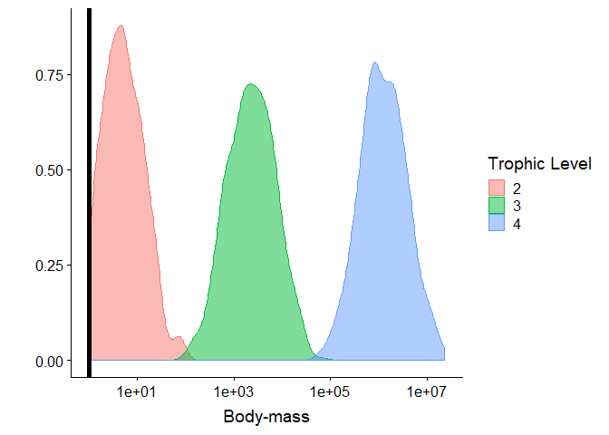
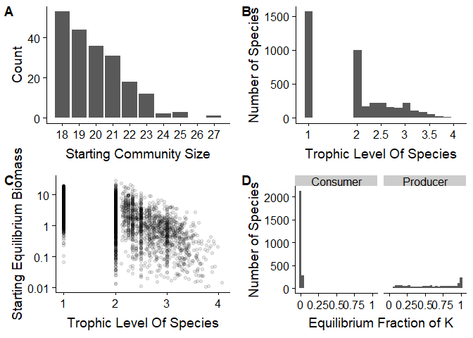
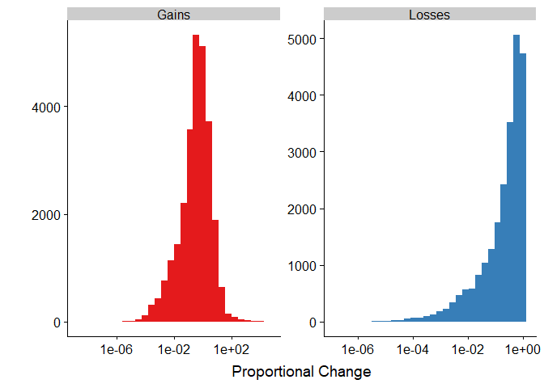

SI Code
================
Chris Terry
02 April, 2019

## Introduction

This is a tidied version of the code used to generate the supplementary
results in Terry et al (2019) *Interaction modifications lead to greater
robustness than pairwise non-trophic effects in food webs*

``` r
library(deSolve)
library(igraph)
library(numDeriv)
library(rootSolve)
library(NetIndices)
library(pbapply)
library(knitr)
library(cowplot)
library(mvbutils)
library(Rcpp)
library(pracma)
library(parallel)
library(tidyverse)

NUM_CORES <- 3 # Number of cores to use for parallel
```

``` r
try(sapply(paste0('Scripts/',list.files('Scripts')), source)->tmp)

ParallelRun <- function(DATA,FUNC,Name, ...){
  c1<- makeCluster(NUM_CORES)
  clusterEvalQ(c1,
               {require(dplyr);require(rootSolve);
                 require(deSolve);require(igraph);require(purrr)})->tmp
  clusterExport(c1,as.list(find.funs()[find.funs()!='LV']))
  pblapply(X =DATA, cl = c1,FUN = FUNC,...)-> tmp
  assign(value = tmp,Name)
  save(list=Name,file=paste0('Output from Simulations/',Name))
  stopCluster(c1) 
}

Unpacker <- function(SafeObject){
  SafeObject  %>%transpose %>% `[[`('result') %>% compact() -> x
  return(x)
}

ErrorFinder<- function(SafeObject){
  SafeObject  %>%transpose %>% `[[`('error') -> errormessages
  errormessages %>% map_lgl(is.null) %>% `!` %>% which %>% print
  errormessages %>% compact() %>% print()
}
```

# SI

## SI 1. Body mass distribution

``` r
load('Output from Simulations/BaseCommunities_Success')

BaseCommunities_Success<-BaseCommunities_Success[1:200]

BaseCommunities_Success%>%
  map(CutModelDown)%>%
  map('web') %>%
  map(GetTL) %>% unlist-> NewTLs

BaseCommunities_Success %>%
  map(CutModelDown) -> CutDown

map_dbl(CutDown,'StartingNum')-> Sp
map(CutDown,'TL')%>% unlist-> TL
map(CutDown,'StartPoints')%>% unlist-> Eqm
map(CutDown,'K')%>% unlist-> K

## Body Size / TL
map(BaseCommunities_Success,function(Model){
return(Model$BMs[which(Model$Start>0)])
})%>% unlist-> BM

data.frame(BM, TL)%>%
  filter(TL>1,TL < 5)%>%
  ggplot(aes(col=factor(TL), fill= factor(TL), x=BM))+
  geom_density(alpha=0.5)+
  scale_x_log10()+
  geom_vline(xintercept =1, size=2 )+
 scale_color_discrete(name='Trophic Level')+
   scale_fill_discrete(name='Trophic Level')+
  labs(x='Body-mass', y='')
```

<!-- -->

``` r
ggsave('Figures/Distribution of Body Masses.png', width = 6, height=4, dpi = 400)
```

### SI 2. Details of starting populations

``` r
data.frame('NumberSp'=Sp)%>%
  ggplot(aes(x=Sp))+
  geom_bar()+
  scale_x_continuous(breaks=18:27, labels=18:27)+
  labs(x= 'Starting Community Size', y= 'Count') -> A

data.frame(NewTLs)%>%
  ggplot(aes(x=NewTLs))+
  geom_histogram(bins=20)+
  scale_x_continuous(breaks=c(1,2,2.5,3,3.5,4),
                     labels=c(1,2,2.5,3,3.5,4),
                     limits = c(0.9,4.1))+
  labs( x='Trophic Level Of Species', y='Number of Species') -> B
tail(sort(NewTLs),10)
```

    ##  [1] 3.950000 3.987842 4.063360 4.152192 4.437056 4.696429 4.925517
    ##  [8] 4.971335 6.417379 7.417379

``` r
data.frame(NewTLs, Eqm)%>%
  filter(Eqm > 0.01)%>%
  ggplot(aes(x=NewTLs, y=Eqm))+
  geom_point(alpha=0.1)+
  scale_y_log10(breaks=c(0.001, 0.01, 0.1, 1, 10, 100) ,
                labels=c(0.001, 0.01, 0.1, 1, 10, 100 ))+
  labs(y='Starting Equilibrium Biomass', x='Trophic Level Of Species') -> C


data.frame('C' =Eqm/K,  TL)%>%
  mutate(TLCat = ifelse(TL==1,'Producer', 'Consumer'  ))%>%
  ggplot(aes(x=C))+
  geom_histogram()+
  facet_wrap(~TLCat)+
  scale_x_continuous(breaks=c(0,0.25, 0.5, 0.75,1),
                     labels=c(0,0.25, 0.5, 0.75,1))+
  labs(x='Equilibrium Fraction of K', 
       y='Number of Species') -> D

plot_grid(A,B,C,D, labels = 'AUTO')
```

    ## Warning: Removed 7 rows containing non-finite values (stat_bin).

    ## Warning: Removed 2 rows containing missing values (geom_bar).

    ## `stat_bin()` using `bins = 30`. Pick better value with `binwidth`.

<!-- -->

``` r
ggsave('Figures/CommunityInfoPlots.png', width = 8, height=8, dpi = 400)
```

## SI 5 Initial direction of response

``` r
load(file='Output from Simulations/TIM_Models_Lots_Strong')

TIM_Models_Lots_Strong %>%
  map(TestInitialResponse) -> AllDirectionResponses

AllDirectionResponses%>% 
  unlist %>%
  table -> Dir_Table

Dir_Table / sum(Dir_Table)
```

    ## .
    ##        -1         0         1 
    ## 0.1866640 0.6181806 0.1951553

``` r
Dir_Table[3]/(Dir_Table[1]+Dir_Table[3]) *100
```

    ##        1 
    ## 51.11195

## SI 7. Distribution of Population Shifts

``` r
load('Output from Simulations/TIM_Models_Lots_Strong')
load('Output from Simulations/LS_TIM_Extinctions')

ExtractLosses<-function(model){
  starts<-  model$StartPoints    
  ends<- model$postExtEnd_List
  diffs <- matrix(NA, nrow=model$S, ncol=model$S)
  
  for( i in 1:model$S){
    try({
      diffs[i,] <- (ends[[i]] - starts)/starts
    }, silent = TRUE)
  }
  return(as.vector(diffs[!is.na(diffs)]))
}

LS_TIM_Extinctions%>%
  Unpacker%>%
  map(ExtractLosses)%>%
  unlist-> AllChanges

(AllChanges<0) %>% table
```

    ## .
    ## FALSE  TRUE 
    ## 27047 49742

``` r
Extinctions <- AllChanges[AllChanges == -1]
Losses <-      AllChanges[AllChanges <0 & AllChanges!=-1]
Gains <-       AllChanges[AllChanges >0]

StdChanges<-data.frame(Value = c(-Extinctions, -Losses, Gains),
           Category = c(rep('Extinction',length(Extinctions)),
                        rep('Losses', length(Losses)), 
                        rep('Gains', length(Gains))))

table(StdChanges$Category)
```

    ## 
    ## Extinction      Gains     Losses 
    ##      26251      27047      23491

``` r
StdChanges%>%
  filter(Category !='Extinction')%>%
  ggplot(aes(Value, fill=Category))+
  geom_histogram()+
  scale_x_log10()+
  facet_wrap(~Category, scales = 'free')+
  xlab('Proportional Change')+ ylab('')+
  scale_fill_brewer(palette = 'Set1')+
  guides(fill=FALSE)+

ggsave('Figures/SI7.png', dpi=400, height = 4, width = 9, units='in')
```

<!-- -->

``` r
ExtractOverallLosses<-function(model){
  starts<-  model$StartPoints    
  ends<- model$postExtEnd_List
  diffs <- matrix(NA, nrow=model$S, ncol=1)

  for( i in 1:model$S){
    try({diffs[i,] <- (sum(ends[[i]]) - sum(starts))/sum(starts)}, silent = TRUE)}
  return(as.vector(diffs[!is.na(diffs)]))
}

LS_TIM_Extinctions%>%
  Unpacker%>%
  map(ExtractOverallLosses)%>%
  unlist-> OverallChange
table(OverallChange<0)
```

    ## 
    ## FALSE  TRUE 
    ##   699  3130

# Session Info

``` r
sessionInfo()
```

    ## R version 3.5.3 (2019-03-11)
    ## Platform: x86_64-w64-mingw32/x64 (64-bit)
    ## Running under: Windows 10 x64 (build 17134)
    ## 
    ## Matrix products: default
    ## 
    ## locale:
    ## [1] LC_COLLATE=English_United Kingdom.1252 
    ## [2] LC_CTYPE=English_United Kingdom.1252   
    ## [3] LC_MONETARY=English_United Kingdom.1252
    ## [4] LC_NUMERIC=C                           
    ## [5] LC_TIME=English_United Kingdom.1252    
    ## 
    ## attached base packages:
    ## [1] parallel  stats     graphics  grDevices utils     datasets  methods  
    ## [8] base     
    ## 
    ## other attached packages:
    ##  [1] forcats_0.4.0     stringr_1.4.0     dplyr_0.8.0.1    
    ##  [4] purrr_0.3.2       readr_1.3.1       tidyr_0.8.3      
    ##  [7] tibble_2.1.1      tidyverse_1.2.1   pracma_2.2.2     
    ## [10] Rcpp_1.0.1        mvbutils_2.8.232  cowplot_0.9.4    
    ## [13] ggplot2_3.1.0     knitr_1.22        pbapply_1.4-0    
    ## [16] NetIndices_1.4.4  MASS_7.3-51.1     rootSolve_1.7    
    ## [19] numDeriv_2016.8-1 igraph_1.2.4      deSolve_1.21     
    ## 
    ## loaded via a namespace (and not attached):
    ##  [1] tidyselect_0.2.5   xfun_0.5           haven_2.1.0       
    ##  [4] lattice_0.20-38    colorspace_1.4-1   generics_0.0.2    
    ##  [7] htmltools_0.3.6    yaml_2.2.0         rlang_0.3.2       
    ## [10] pillar_1.3.1       glue_1.3.1         withr_2.1.2       
    ## [13] RColorBrewer_1.1-2 readxl_1.3.1       modelr_0.1.4      
    ## [16] plyr_1.8.4         cellranger_1.1.0   munsell_0.5.0     
    ## [19] gtable_0.2.0       rvest_0.3.2        evaluate_0.13     
    ## [22] labeling_0.3       broom_0.5.1        scales_1.0.0      
    ## [25] backports_1.1.3    jsonlite_1.6       hms_0.4.2         
    ## [28] digest_0.6.18      stringi_1.4.3      grid_3.5.3        
    ## [31] cli_1.1.0          tools_3.5.3        magrittr_1.5      
    ## [34] lazyeval_0.2.2     crayon_1.3.4       pkgconfig_2.0.2   
    ## [37] xml2_1.2.0         lubridate_1.7.4    rstudioapi_0.10   
    ## [40] assertthat_0.2.1   rmarkdown_1.12     httr_1.4.0        
    ## [43] R6_2.4.0           nlme_3.1-137       compiler_3.5.3
